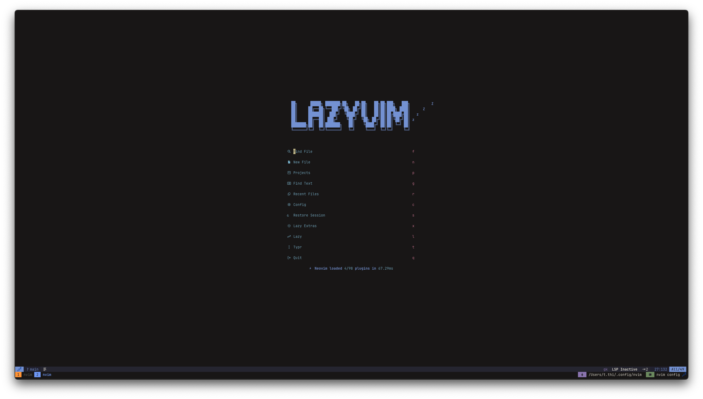
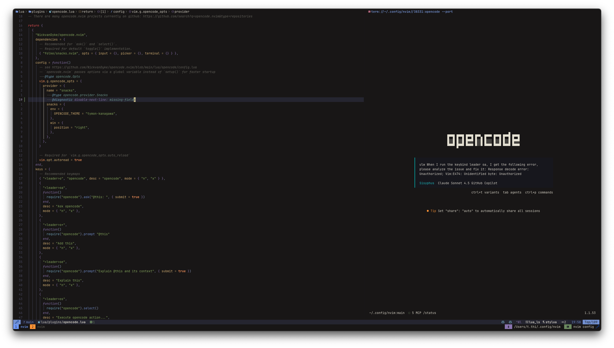

# 💤 tvim

[](LICENSE)
[](https://neovim.io)
[](https://lazyvim.org)

Personal Neovim config built on [LazyVim](https://lazyvim.org).
[LunarVim](https://lunarvim.org/) was my first config distro, and the lualine
theme is inspired by its statusline.





## ✨ Features

- **🤖 AI-Powered Coding** - Copilot (inline), Copilot NES via Sidekick, OpenCode
- **🌐 Multi-Language Support** - Go, Python, Rust, TypeScript, Lua, Markdown + 6
  more
- **📝 Note-Taking** - Deep Obsidian.nvim integration
- **🎨 Beautiful UI** - Kanagawa colorscheme with Tokyo Night & Catppuccin
  fallbacks
- **⚡ Fast & Lazy** - 51 custom plugins + 30 LazyVim extras, all lazy-loaded

## ⚡ Requirements

- Neovim >= 0.10.0
- Git
- A [Nerd Font](https://www.nerdfonts.com/) (optional but recommended)
- For telescope: `ripgrep`, `fd`
- For clipboard: `xclip`/`xsel` (Linux) or `pbcopy` (macOS)

## 🚀 Installation

### Backup existing config

```sh
mv ~/.config/nvim ~/.config/nvim.bak
mv ~/.local/share/nvim ~/.local/share/nvim.bak
```

### Clone tvim

```sh
git clone https://github.com/tnthi115/lazyvim.git ~/.config/nvim
```

### Start Neovim

```sh
nvim
```

Lazy.nvim will auto-install plugins on first launch.

### macOS Sequoia Users

See [Known Issues](#known-issues--workarounds) for code signing workaround.

## 📂 Structure

```text
nvim/
├── init.lua              # Entry point
├── lua/
│   ├── config/           # Core settings (options, keymaps, autocmds)
│   ├── plugins/          # 51 custom plugins
│   │   ├── core/         # 20 LazyVim overrides
│   │   └── lang/         # 12 language configs
│   └── snippets/         # Custom snippets
├── lazyvim.json          # LazyVim extras (30 enabled)
└── stylua.toml           # Lua formatter config
```

## 🔌 Plugins

See [PLUGINS.md](PLUGINS.md) for complete list.

### Highlights

| Category | Notable Plugins |
|----------|-----------------|
| AI/LLM | Copilot, Sidekick, OpenCode |
| Languages | Go, Python (basedpyright), Rust, TypeScript |
| Productivity | Obsidian, LeetCode, Harpoon |
| Git | Diffview, Neogit, Fugitive, git-worktree |
| UI | Kanagawa, Lualine, Dropbar |

## ⚙️ Configuration

This config uses LazyVim as a base. To customize:

1. **Add plugins:** Create `lua/plugins/your-plugin.lua`
2. **Override LazyVim:** Modify files in `lua/plugins/core/`
3. **Language support:** Add to `lua/plugins/lang/`
4. **Keymaps:** Edit `lua/config/keymaps.lua` or use plugin `keys` table
5. **Options:** Edit `lua/config/options.lua`

## Known Issues / Workarounds

### macOS Sequoia Code Signing

**Status:** Active workaround in `lua/config/autocmds.lua`

macOS Sequoia (15.x+) enforces code signature validation. Locally compiled
`.so`/`.dylib` files are unsigned and cause crashes (SIGKILL, exit 137).

**Solution:** Auto-signs all binaries after plugin operations.

**Last verified:** Feb 2026 on macOS 15.7.3

## 🤝 Contributing

Contributions welcome! See [CONTRIBUTING.md](CONTRIBUTING.md).

## 📋 Development

See [TODO.md](TODO.md) for planned improvements.

## 📄 License

[Apache 2.0](LICENSE)

## 🙏 Acknowledgements

- [LazyVim](https://lazyvim.org) - Base configuration framework
- [LunarVim](https://lunarvim.org) - Inspiration for lualine theme
- [folke](https://github.com/folke) - lazy.nvim and many essential plugins
